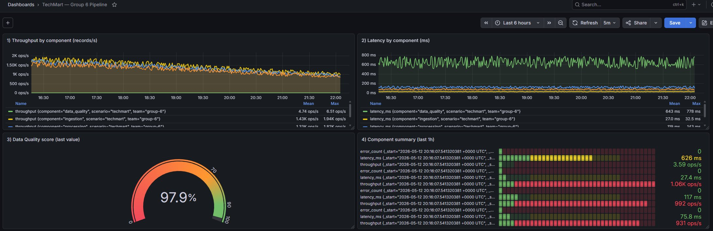

# TechMart — Real-time Data Pipeline (Kappa Architecture)

> End-to-end streaming data platform for a fictional e-commerce retailer, built as a group project for a Big Data Architecture course. Implements a Kappa architecture with real-time fraud detection, data quality validation, and pipeline observability.

---

## Project Overview

TechMart is an online electronics retailer with 10M registered users and 500K SKUs. The platform was redesigned to address three critical problems:

- Inventory updated only nightly — causing oversells during promotions
- Merchandising team working with day-old reports
- No fraud detection — chargebacks growing 30% per year

The solution is a **Kappa architecture** pipeline that keeps inventory and dashboards refreshed in near real-time, scores fraud at checkout, and serves product recommendations — all self-hosted with open-source tooling.

---

## Tech Stack

| Layer | Tool |
|---|---|
| Event Streaming | Apache Kafka |
| Stream Processing | Apache Spark Structured Streaming |
| Data Quality | PySpark + PyDeequ |
| Storage (OLTP + Analytics) | PostgreSQL |
| Cache + Fraud Blocklist | Redis |
| Pipeline Metrics | InfluxDB |
| Observability Dashboard | Grafana |
| Serving API | FastAPI |

---

## Architecture

**Pattern selected: Kappa**

A single Spark Structured Streaming job consumes Kafka, applies the PyDeequ quality gate and rule-based fraud scorer, and writes to PostgreSQL and Redis. Pipeline metrics are pushed to InfluxDB and visualised in Grafana.

```
Sources (Storefront / Order Service / Inventory CDC)
        |
   Apache Kafka
   (topics: orders, clicks, inventory)
        |
   Spark Structured Streaming
   (enrich → PyDeequ DQ gate → fraud rules → aggregate)
        |
   ----------------+-----------------
   |               |                |
PostgreSQL       Redis           InfluxDB
(orders,       (hot cache,     (pipeline metrics)
daily_sales,   fraud blocklist)       |
top_products)                     Grafana
   |
FastAPI (storefront /orders /recommend /fraud-check)
```

**Why Kappa over Lambda:**
- Single codebase, one engine, one team
- Kafka offset replay covers reprocessing — no separate batch path
- Operational simplicity prioritised over absolute lowest latency

---

## Pipeline Specifications

| Metric | Target |
|---|---|
| End-to-end stream latency | < 10s |
| Fraud check latency | < 200ms p95 |
| Sustained throughput | 2K events/s |
| Peak throughput | 10K events/s (5× headroom) |
| Availability | 99.5% monthly |
| Data quality gate | ≥ 90% constraint pass rate |

---

## Data Quality

12 constraints implemented across 5 quality dimensions using **PyDeequ**:

| Dimension | Checks |
|---|---|
| Completeness | order_id, customer_id, product_id not null |
| Uniqueness | order_id unique |
| Validity | quantity in [1,50], unit_price in (0,10000], total ≥ 0 |
| Consistency | total_amount = quantity × unit_price, status and payment_method in allow-lists |
| Timeliness | order_date not in future, within last 5 years |

**Latest run result: 100% — GREEN gate (12/12 constraints passed)**

---

## Observability Dashboard



Four panels monitoring the pipeline in real-time:
- **Throughput** by component (records/s)
- **Latency** by component (ms)
- **Data Quality score** gauge (last value)
- **Component summary** table (last 1h)

---

## Repository Structure

```
techmart-pipeline/
|
|-- data_quality.ipynb          # PySpark + PyDeequ data quality notebook
|-- seed_metrics.py             # Seeds pipeline metrics into InfluxDB
|-- grafana_dashboard.json      # Grafana dashboard (importable)
|
|-- quality_reports/
|   |-- dq_results.json         # Latest DQ run output (100% GREEN)
|
|-- images/
|   |-- grafana_dashboard.png   # Live dashboard screenshot
|
|-- README.md
```

---

## How to Run

**Prerequisites:** Docker, Python 3.8+, PySpark, PyDeequ

**1. Start the stack**
```bash
docker compose up -d kafka influxdb grafana
```

**2. Seed pipeline metrics**
```bash
python seed_metrics.py --hours 24 --url http://localhost:8086
```

**3. Import the Grafana dashboard**
- Open Grafana at `http://localhost:3000`
- Go to Dashboards → Import → upload `grafana_dashboard.json`

**4. Run the data quality notebook**
```bash
jupyter notebook data_quality.ipynb
```

---

## Key Design Decisions

- **Kappa over Lambda** — single codebase, replay via Kafka offsets, no second batch path
- **Rule-based fraud over ML** — no labelled fraud history; explainable rules as v1
- **SQL materialised view for recommendations** — solves cold-start and popularity case without model artefacts
- **Self-hosted over managed cloud** — estimated at ~€30/month vs ~€4,500/month for equivalent AWS managed services

---

## Skills Demonstrated

- Kappa architecture design and trade-off analysis
- Apache Kafka event streaming
- Spark Structured Streaming pipeline
- Data quality engineering with PyDeequ (12 constraints, 5 dimensions)
- Pipeline observability with InfluxDB + Grafana
- Fraud detection rule engine
- Python (PySpark, influxdb-client, FastAPI)
- Cost estimation and scaling projections

---

*Big Data Architecture project, ISEP 2026. Group project.*
